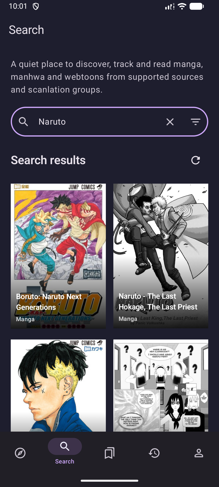
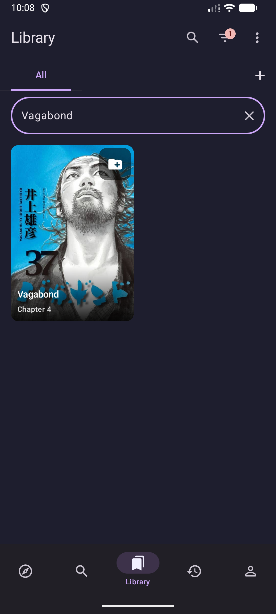
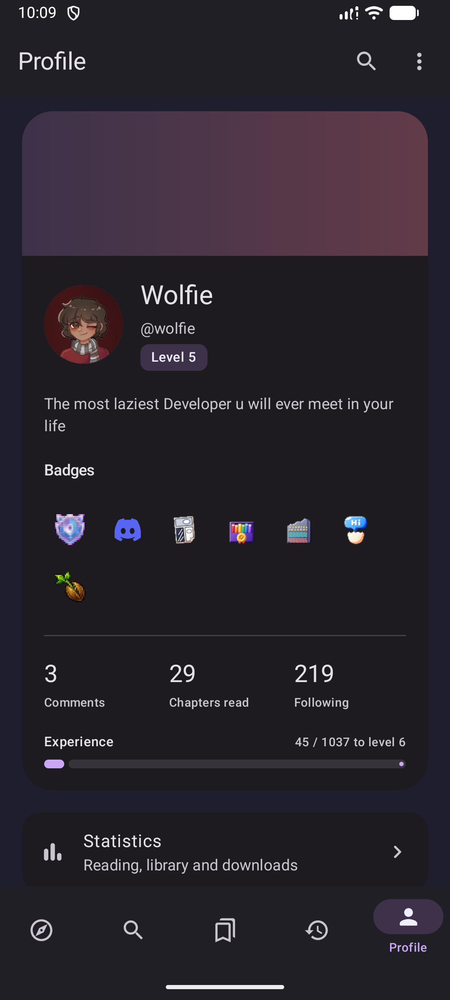
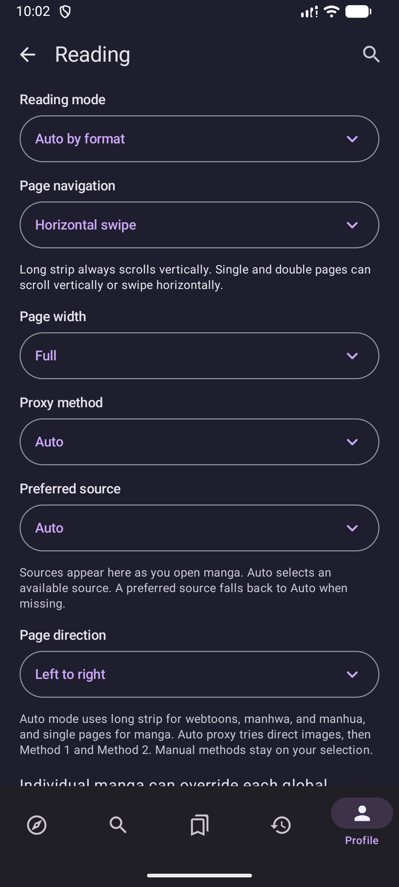
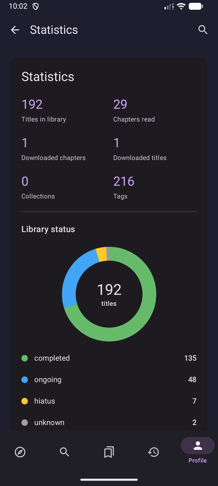

# Comico for Android

An independent Android app for [comico.moe](https://comico.moe). Android 8.0+.

[Download APK](https://github.com/Wolfkid200444/comico-android/releases/latest) · [Changelog](https://github.com/Wolfkid200444/comico-android/releases) · [Report an issue](https://github.com/Wolfkid200444/comico-android/issues)

## Screenshots

<table>
<tr>
<th>Search</th><th>Library</th><th>Profile</th><th>Reader settings</th><th>Statistics</th>
</tr>
<tr>
<td></td>
<td></td>
<td></td>
<td></td>
<td></td>
</tr>
</table>

## Features

<table>
<tr>
<td width="50%" valign="top">
<h3>Discover & search</h3>
<ul><li>Recently updated and popular titles</li><li>Type, status, rating, and tag filters</li><li>Source, language, and group selection</li></ul>
</td>
<td width="50%" valign="top">
<h3>Library</h3>
<ul><li>Collections and bulk selection</li><li>Filters, sorting, grid and list views</li><li>Reading history and resume</li></ul>
</td>
</tr>
<tr>
<td valign="top">
<h3>Reader</h3>
<ul><li>Full-screen reading and pinch zoom</li><li>Long strip, single and double pages</li><li>Global and per-title settings</li></ul>
</td>
<td valign="top">
<h3>Offline & account</h3>
<ul><li>Chapter downloads and automatic saving</li><li>Local Library access while offline</li><li>Account library and history sync</li></ul>
</td>
</tr>
<tr>
<td valign="top">
<h3>Appearance</h3>
<ul><li>Light, dark, and pure black themes</li><li>Color palettes and Android dynamic colors</li></ul>
</td>
<td valign="top">
<h3>More</h3>
<ul><li>Reading and library statistics</li><li>In-app updates and changelogs</li></ul>
</td>
</tr>
</table>

Chapters work offline once all their images finish saving. Manage downloads in Settings.

## Install

Download the APK and open it on your phone. Allow installation from your browser or file manager if Android asks. GitHub builds use a public test key; updates signed with the same key keep your local data.

## Build

Use Android Studio with JDK 17 and Android SDK 35, or run:

```sh
./gradlew :app:testDebugUnitTest :app:lintDebug :app:assembleDebug
```

APK output: `app/build/outputs/apk/debug/`.
